# SmartStocks
Smart Stocks is Stock traders dashboard Application created using Django Framework with postgres as the database.

## Features 
* Stock prices of over 8000 companies as listed on NASDAQ. 

* Implemented independent jenkins job which update stock prices of all the companies daily at 5:00 PM

*  Implemented independent jenkins job which updates Machine Learning models only of the companies which have been visited by the user. Updates every Monday at 7:00 AM

* The price predictions generated are real-time. The model takes into account the latest 60 days stock prices to make a dynamic prediction.

* Recent News of a particular stock are readily available right below the price prediction so that
user can make an informed decision based on the current news and trends.

* Implemented Continous Delivery using Rundeck 

* 

* Implemented Neural Networks with LSTM nodes for predictions using keras. With the structure : 60 - 50 - 50 - 1. The hidden layers are the LSTM nodes. Input and Ouput layers are Dense Nodes.

### Project Structure
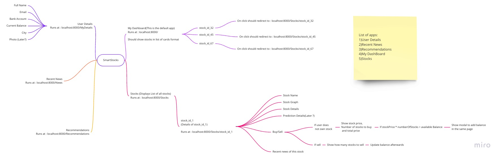

### Home Page
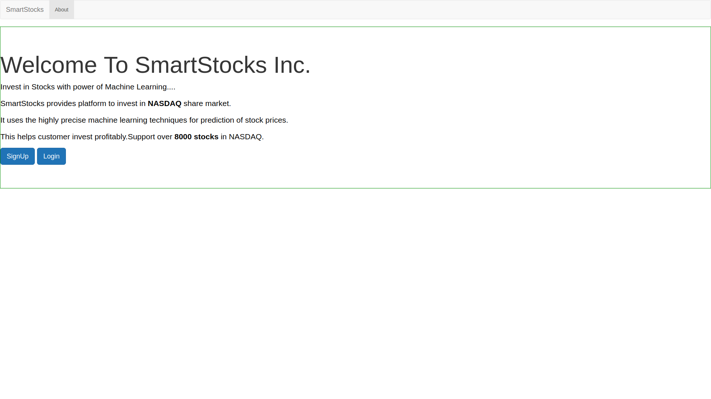

### Dashboard
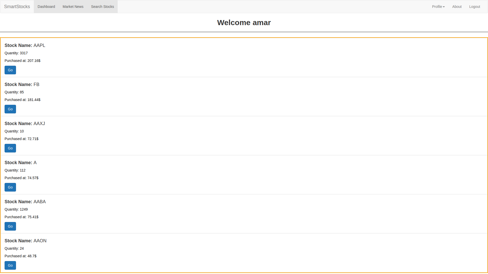

### Stocks List
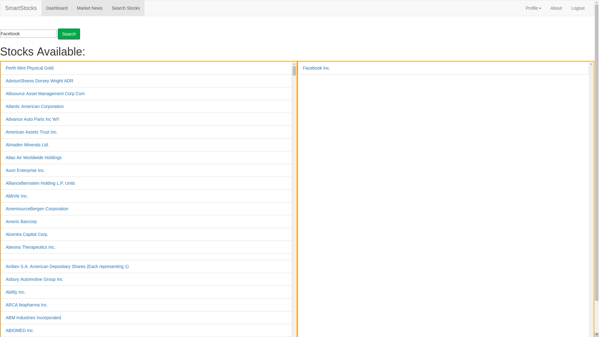

### Stock Detail
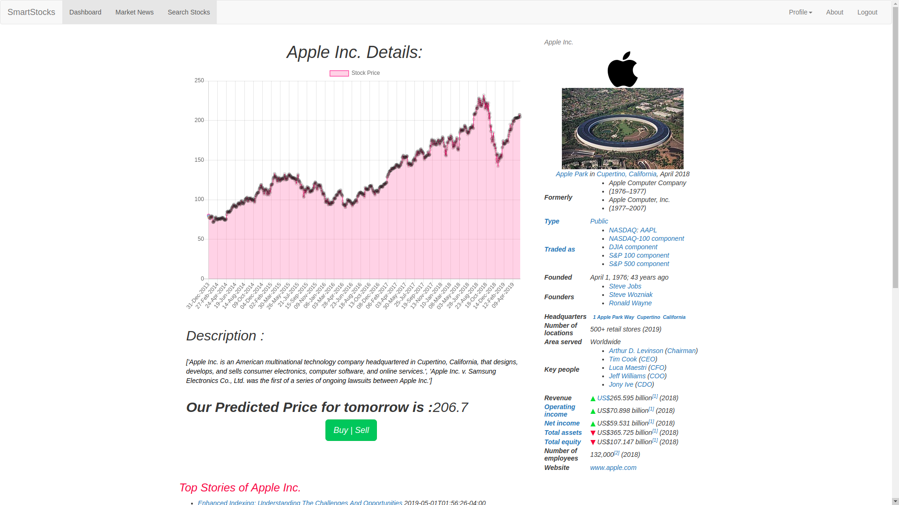

### Transaction
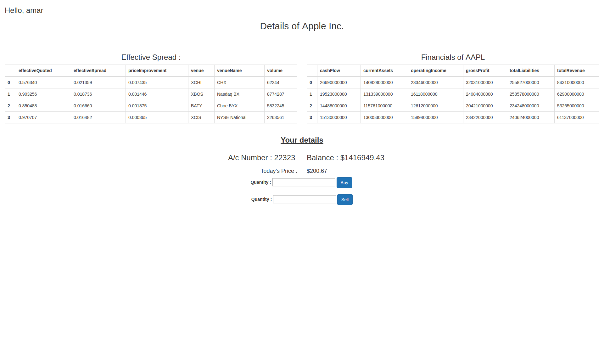

### Stock Updater
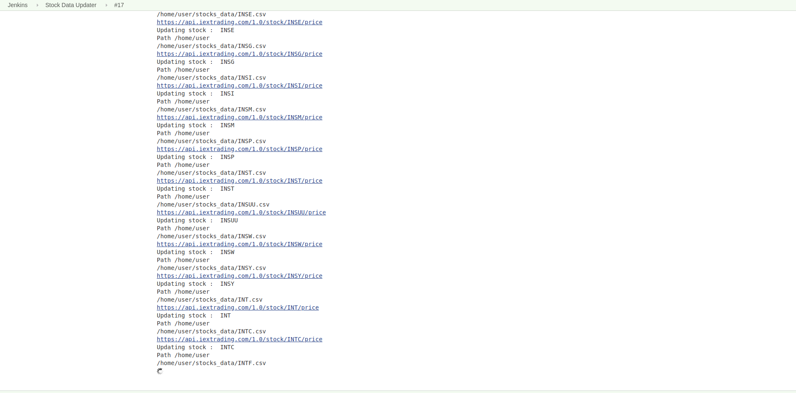

### Model Updater
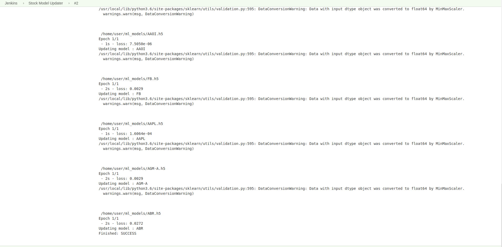

## CI/CD

### Jenkins Pipeline
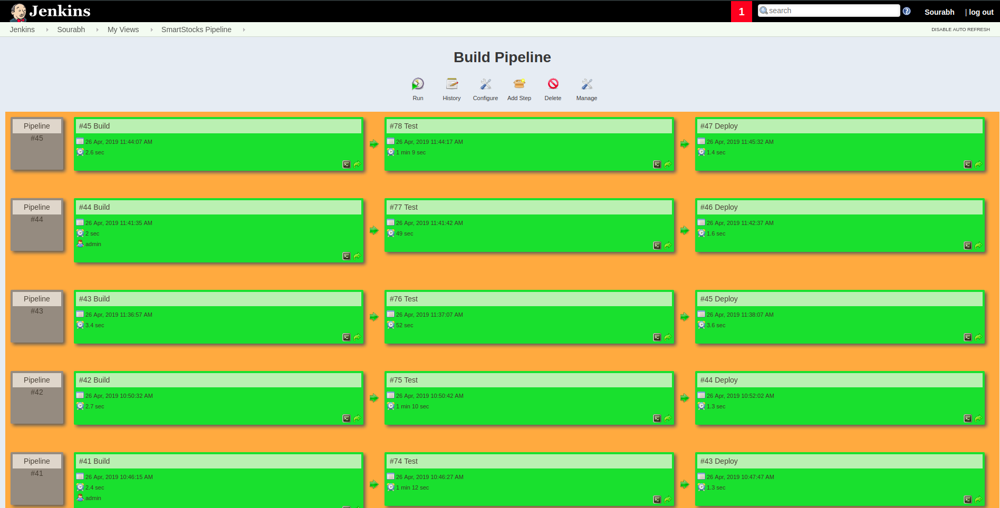

### Rundeck
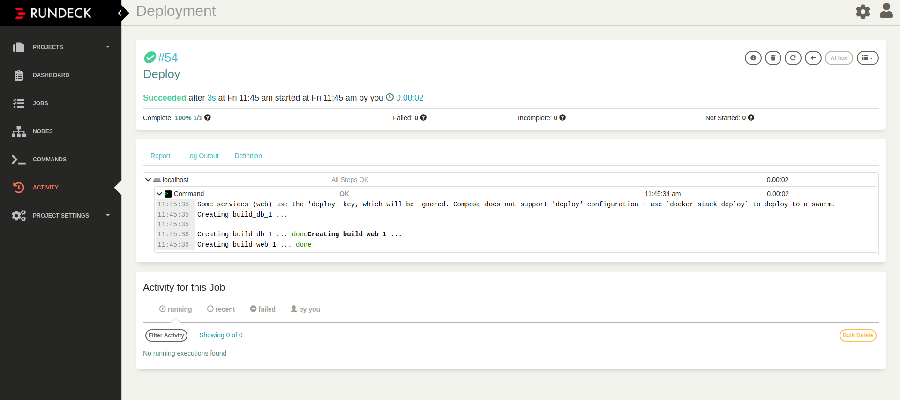

### Kibana logs
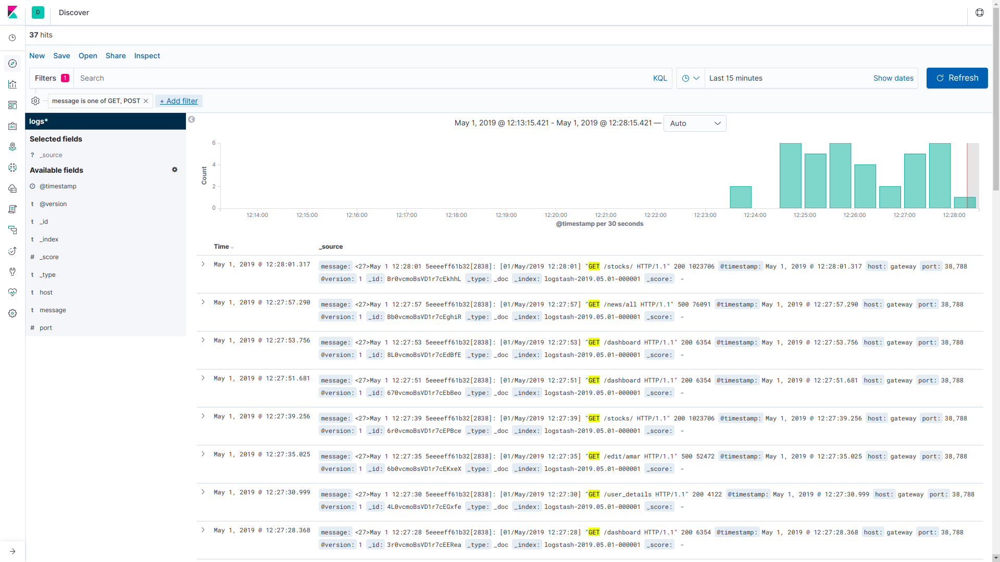

### Metric Beat 
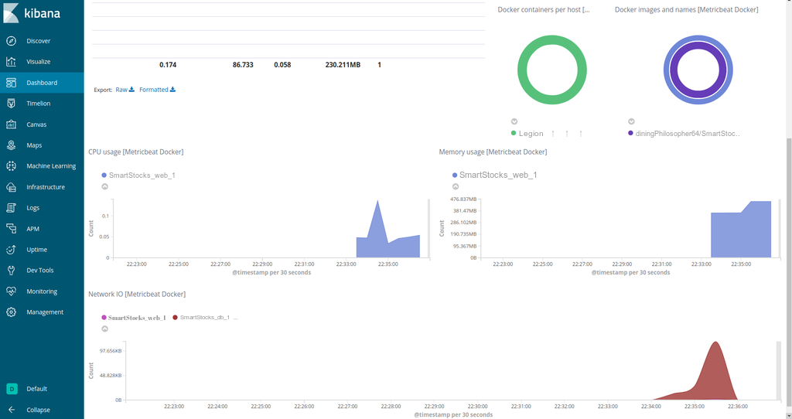